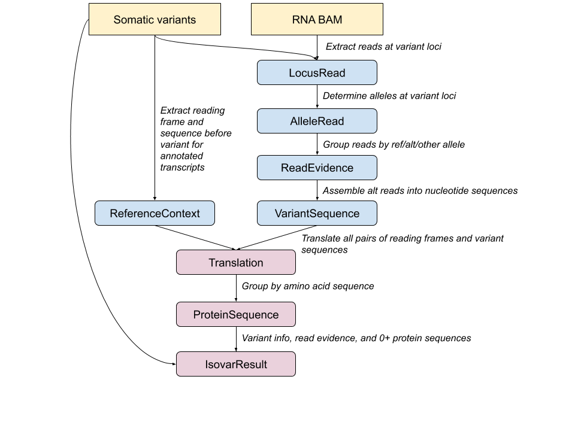

<a href="https://travis-ci.org/openvax/isovar">
    
</a>
<a href="https://coveralls.io/github/openvax/isovar?branch=master">
    
</a>
<a href="https://pypi.python.org/pypi/isovar/">
    
</a>

# Isovar

* [Overview](#overview)
* [Python API](#python-api)
* [Commandline](#commandline)
* [Internal Design](#internal-design)
* [Other Isovar Commandline Tools](#other-isovar-commandline-tools)
* [Sequencing Recommendations](#sequencing-recommendations)

## Overview
Isovar determines mutant protein subsequences around mutations from cancer RNAseq data.

Isovar works by:

 1) collecting RNA reads which spanning the location of a variant,

 2) filtering the RNA reads to those which support the mutation,

 3) assembling mutant reads into longer coding sequences,  

 4) matching mutant coding sequences against reference annotated reading
frames, and

 5) translating coding sequences determined directly from RNA into mutant protein sequences.

The assembled coding sequences may incorporate proximal 
(germline and somatic) variants, along with any splicing alterations 
which occur due to modified splice signals.

## Python API

In the example below, `isovar.run_isovar` returns a list of `isovar.IsovarResult` objects. 
Each of these objects corresponds to a single input variant and contains all of the information about the RNA evidence at that variant's location and any mutant protein sequences which were assembled for the variant.

```python

from isovar import run_isovar

isovar_results = run_isovar(
    variants="cancer-mutations.vcf",
    alignment_file="tumor-rna.bam")
    
# this code traverses every variant and prints the number
# of RNA reads which support the alt allele for variants
# which had a successfully assembled/translated protein sequence
for isovar_result in isovar_results:
    # if any protein sequences were assembled from RNA
    # then the one with most supporting reads can be
    # accessed from a property called `top_protein_sequence`.
    if isovar_result.top_protein_sequence is not None:
        # print number of distinct fragments supporting the
        # the variant allele for this mutation
        print(isovar_result.variant, isovar_result.num_alt_fragments)
    
```

A collection of `IsovarResult` objects can also be flattened into a Pandas DataFrame:

```python

from isovar import run_isovar, isovar_results_to_dataframe

df =  isovar_results_to_dataframe(
        run_isovar(
            variants="cancer-mutations.vcf",
            alignment_file="tumor-rna.bam"))
```


### Python API options for collecting RNA reads

To change how Isovar collects and filters RNA reads you can create
your own instance of the `isovar.ReadCollector` class and pass it to `run_isovar`.
```python
from isovar import run_isovar, ReadCollector

# create a custom ReadCollector to change options for how RNA reads are processed
read_collector = ReadCollector(
    use_duplicate_reads=True,
    use_secondary_alignments=True, 
    use_soft_clipped_bases=True)

isovar_results = run_isovar(
    variants="cancer-mutations.vcf",
    alignment_file="tumor-rna.bam",
    read_collector=read_collector)

````


### Python API options for coding sequence assembly and translation

To change how Isovar assembles RNA reads into coding sequences, determines their
reading frames, and groups translated amino acid sequences you can create your
own instance of the `isovar.ProteinSequenceCreator` class and pass it to `run_isovar`.


```python
from isovar import run_isovar, ProteinSequenceCreator

# create a custom ProteinSequenceCreator to change options for how
# protein sequences are assembled from RNA reads
protein_sequence_creator = ProteinSequenceCreator(
    # number of amino acids we're aiming for, coding sequences
    # might still give us a shorter sequence due to an early stop 
    # codon or poor coverage
    protein_sequence_length=30,
    # minimum number of reads covering each base of the coding sequence
    min_variant_sequence_coverage=2,
    # how much of a reference transcript should a coding sequence match before
    # we use it to establish a reading frame
    min_transcript_prefix_length=20,
    # how many mismatches allowed between coding sequence (before the variant)
    # and transcript (before the variant location)
    max_transcript_mismatches=2,
    # also count mismatches after the variant location toward
    # max_transcript_mismatches
    count_mismatches_after_variant=False,
    # if more than one protein sequence can be assembled for a variant
    # then drop any beyond this number 
    max_protein_sequences_per_variant=1,
    # if set to False then coding sequence will be derived from
    # a single RNA read with the variant closest to its center
    variant_sequence_assembly=True,
    # how many nucleotides must two reads overlap before they are combined
    # into a single coding sequence
    min_assembly_overlap_size=30)

isovar_results = run_isovar(
    variants="cancer-mutations.vcf",
    alignment_file="tumor-rna.bam",
    protein_sequence_creator=protein_sequence_creator)
```

### Python API for filtering results

You can filter a collection of `IsovarResult` objects by any of their numerical properties using the `filter_thresholds` option
of the `run_isovar` function. The value expected for this argument is a dictionary whose keys have named like `'min_fraction_ref_reads'` or `'max_num_alt_fragments'`  and whose values are numerical thresholds.
Everything after the `'min_'` or `'max_'` at the start of a key is expected to be the name of a property of `IsovarResult`. 
Many of the commonly accessed properties regarding RNA read evidence follow the pattern: 
```
{num|fraction}_{ref|alt|other}_{reads|fragments} 
```

For example, in the following code the results are filtered to have 10 or more alt reads supporting a variant and no more than 25% of the fragments supporting an allele other than the ref or alt.
```python
from isovar import run_isovar

isovar_results = run_isovar(
    variants="cancer-mutations.vcf",
    alignment_file="tumor-rna.bam",
    filter_thresholds={"min_num_alt_reads": 10, "max_fraction_other_fragments": 0.25})    

for isovar_result in isovar_results:
    # print each variant and whether it passed both filters
    print(isovar_result.variant, isovar_result.passes_all_filters)
```

A variant which fails one or more filters is not excluded from the result collection but it has `False` values in its corresponding 
`filter_values` dictionary property and will have a `False` value for the `passes_all_filters` property. 

If a result collection is flattened into a DataFrame then each filter is included as a column. 

It's also possible to filter on boolean properties (without numerical thresholds) by passing `filter_flags` to `run_isovar`. These boolean
properties can be further negated by prepending 'not_' to the property name, so that both `'protein_sequence_matches_predicted_effect'` and `'not_protein_sequence_matches_predicted_effect'` are valid names for `filter_flags`.

## Commandline 

Basic example:

```sh
$ isovar  \
    --vcf somatic-variants.vcf  \
    --bam rnaseq.bam \
    --protein-sequence-length 30 \
    --output isovar-results.csv
```

### Commandline options for loading variants

###
```
  --vcf VCF             Genomic variants in VCF format
  
  --maf MAF             Genomic variants in TCGA's MAF format
  
  --variant CHR POS REF ALT
                        Individual variant as 4 arguments giving chromsome,
                        position, ref, and alt. Example: chr1 3848 C G. Use
                        '.' to indicate empty alleles for insertions or
                        deletions.
  
  --genome GENOME       What reference assembly your variant coordinates are
                        using. Examples: 'hg19', 'GRCh38', or 'mm9'. This
                        argument is ignored for MAF files, since each row
                        includes the reference. For VCF files, this is used if
                        specified, and otherwise is guessed from the header.
                        For variants specfied on the commandline with
                        --variant, this option is required.
  
  --download-reference-genome-data
                        Automatically download genome reference data required
                        for annotation using PyEnsembl. Otherwise you must
                        first run 'pyensembl install' for the release/species
                        corresponding to the genome used in your VCF.
  
  --json-variants JSON_VARIANTS
                        Path to Varcode.VariantCollection object serialized as
                        a JSON file.

```

### Commandline options for loading aligned tumor RNA-seq reads

```
  --bam BAM             BAM file containing RNAseq reads
  
  --min-mapping-quality MIN_MAPPING_QUALITY
                        Minimum MAPQ value to allow for a read (default 1)
  
  --use-duplicate-reads
                        By default, reads which have been marked as duplicates
                        are excluded.Use this option to include duplicate
                        reads.
                        
  --drop-secondary-alignments
                        By default, secondary alignments are included in
                        reads, use this option to instead only use primary
                        alignments.
```

### Commandline options for coding sequence assembly
```
  --min-variant-sequence-coverage MIN_VARIANT_SEQUENCE_COVERAGE
                        Minimum number of reads supporting a variant sequence
                        (default 2)
                        
  --disable-variant-sequence-assembly
                        Disable assemble variant cDNA sequence from
                        overlapping reads
```

### Commandline options for translating cDNA to protein sequence
```
  --protein-sequence-length PROTEIN_SEQUENCE_LENGTH
  
  --max-reference-transcript-mismatches MAX_REFERENCE_TRANSCRIPT_MISMATCHES
                        Maximum number of mismatches between variant sequence
                        reference sequence before a candidate reading frame is
                        ignored.
                        
  --count-mismatches-after-variant
                        If true, mismatches after the variant locus will count
                        toward the --max-reference-transcript-mismatches
                        filter.
                        
  --min-transcript-prefix-length MIN_TRANSCRIPT_PREFIX_LENGTH
                        Number of nucleotides before the variant we try to
                        match against a reference transcript. Values greater
                        than zero exclude variants near the start codon of
                        transcripts without 5' UTRs.
                        
  --max-protein-sequences-per-variant MAX_PROTEIN_SEQUENCES_PER_VARIANT

```

### Commandline options for filtering 

```
  --min-alt-rna-reads MIN_ALT_RNA_READS
                        Minimum number of reads supporting variant allele
                        (default 3)

  --min-alt-rna-fragments MIN_ALT_RNA_FRAGMENTS
                        Minimum number of fragments supporting variant allele
                        (default 2). Note that this option is the same as
                        --min-alt-rna-reads for single-end sequencing.

  --min-alt-rna-fraction MIN_ALT_RNA_FRACTION
                        Minimum ratio of fragments supporting variant allele
                        to total RNA fragments (default 0.005).

  --min-ratio-alt-to-other-fragments MIN_RATIO_ALT_TO_OTHER_FRAGMENTS
                        At loci where alleles other than the ref and a single
                        alt are supported, this parameter controls how many
                        more times fragments supporting the variant allele are
                        required relative to other non-reference alleles
                        (default 3.0).
```

### Commandline options for writing an output CSV

```
  --output OUTPUT       Output CSV file
  
  --output-columns OUTPUT_COLUMNS [OUTPUT_COLUMNS ...]
                        Subset of columns to write

```


## Internal Design



The inputs to Isovar are one or more somatic variant call (VCF) files, along with a BAM file 
containing aligned tumor RNA reads. The following objects are used to aggregate information within Isovar:

* [LocusRead](https://github.com/openvax/isovar/blob/master/isovar/locus_read.py): Isovar examines each variant locus and extracts reads overlapping that locus, 
represented by `LocusRead`. The `LocusRead` representation allows filtering  based
on quality and alignment criteria (e.g. MAPQ > 0) which are thrown away in later stages
of Isovar. 

* [AlleleRead](https://github.com/openvax/isovar/blob/master/isovar/allele_read.py): Once `LocusRead` objects have been filtered, they are converted into a simplified 
representation called `AlleleRead`. Each `AlleleRead` contains only the cDNA sequences 
*before*, *at*, and *after* the variant locus. 

* [ReadEvidence](https://github.com/openvax/isovar/blob/master/isovar/read_evidence.py): 
The set of `AlleleRead` objects overlapping a mutation's location may support many different
distinct allele. The `ReadEvidence` type represents the grouping of these reads into
*ref*, *alt* and *other* `AlleleRead` sets, where *ref* reads agree with the reference
 sequence, *alt* reads agree with the given mutation, and *other* reads contain all
 non-ref/non-alt alleles. The *alt* reads will be used later to determine
a mutant coding sequence, but the *ref* and *other* groups are also kept in case they are
useful for filtering. 

* [VariantSequence](https://github.com/openvax/isovar/blob/master/isovar/variant_sequence.py):
Overlapping `AlleleRead`s containing the same mutation are assembled into a longer
sequence. The `VariantSequence` object represents this candidate coding sequence, as well
as all the `AlleleRead` objects which were used to create it.

* [ReferenceContext](https://github.com/openvax/isovar/blob/master/isovar/reference_context.py): To determine the reading frame in which to translate a `VariantSequence`, Isovar
looks at all Ensembl annotated transcripts overlapping the locus and collapses them
 into one or more `ReferenceContext` object. Each `ReferenceContext` represents the 
 cDNA sequence upstream of the variant locus and in which of the {0, +1, +2} reading frames
  it is translated. 

* [Translation](https://github.com/openvax/isovar/blob/master/isovar/translation.py): Use the reading frame from a `ReferenceContext` to translate a `VariantSequence` 
into a protein fragment, represented by `Translation`.

* [ProteinSequence](https://github.com/openvax/isovar/blob/master/isovar/protein_sequence.py):
Multiple distinct variant sequences and reference contexts can generate the same translations, so we aggregate those equivalent `Translation` objects into a `ProteinSequence`.

* [IsovarResult](https://github.com/openvax/isovar/blob/master/isovar/isovar_result.py): Since a single variant locus might have reads which assemble into multiple incompatible coding sequences, an `IsovarResult` represents a variant and one or more `ProteinSequence` objects which are associated with it. We typically don't want to deal with *every* possible translation of *every* distinct sequence detected around a variant, so the protein sequences are sorted by their number of supporting fragments and the best protein sequence is made easy to access. The `IsovarResult` object also has many informative properties such `num_alt_fragments`, `fraction_ref_reads`, &c.  


## Other Isovar Commandline Tools

<dl>
<dt>isovar-protein-sequences --vcf variants.vcf --bam rna.bam</dt>
<dd>All protein sequences which can be assembled from RNA reads for any of the given variants.</dd>

<dt>isovar-allele-counts --vcf variants.vcf --bam rna.bam</dt>
<dd>Counts of reads and fragments supporting the ref, alt, and other alleles at all given variant locations.</dd>

<dt>isovar-allele-reads --vcf variants.vcf --bam rna.bam</dt>
<dd>Sequences of all reads overlapping any of the given variants.</dd>
 
<dt>isovar-translations --vcf variants.vcf --bam rna.bam</dt>
<dd>All possible translations of any assembled cDNA sequence containing any of the given variants in the reference frame of any matching transcript.</dd>

<dt>isovar-reference-contexts --vcf variants.vcf</dt>
<dd>Shows all candidate reference contexts (sequence and reading frame) before each variant, derived from overlapping reference coding transcripts.</dd>

<dt>isovar-variant-reads --vcf variants.vcf --bam rna.bam</dt>
<dd>Like the isovar-allele-reads command but limited only to reads which support the alt allele.</dd>

<dt>isovar-variant-sequences --vcf variants.vcf --bam rna.bam</dt>
<dd>Shows all assembled cDNA coding sequences supporting any of the given variants.</dd>
</dl>

## Sequencing Recommendations

Isovar works best with high quality / high coverage mRNA sequence data. 
This means that you will get best results from >100M paired-end reads sequenced on an 
Illumina HiSeq from a library enriched with poly-A capture. The number of reads varies 
depending on degree of RNA degradation and tumor purity. The read length will determine 
the longest protein sequence you can recover, since Isovar's cDNA assembly only 
considers reads that overlap a variant. With 100bp reads you will be able to assemble
at most 199bp of sequence around a somatic single nucleotide variant, and consequently 
only be to determine 66 amino acids from the protein sequence. If you disable the cDNA 
assembly algorithm then a 100bp read will only be able to determine 33 amino acids.
