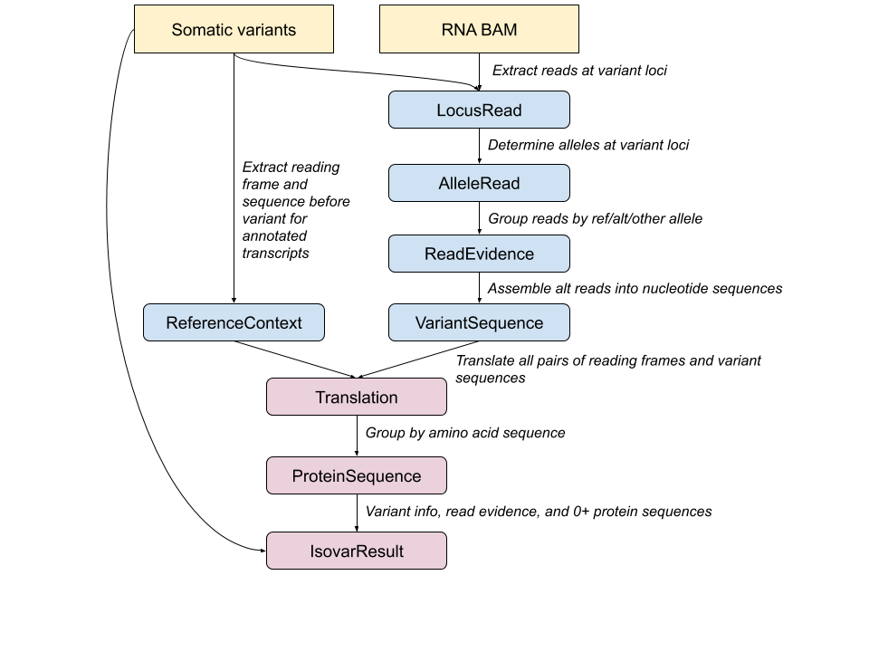

[](https://github.com/openvax/isovar/actions/workflows/tests.yml)
<a href="https://coveralls.io/github/openvax/isovar?branch=master">
    
</a>
<a href="https://pypi.python.org/pypi/isovar/">
    
</a>

# Isovar

* [Overview](#overview)
* [Python API](#python-api)
* [Commandline](#commandline)
* [Internal Design](#internal-design)
* [Other Isovar Commandline Tools](#other-isovar-commandline-tools)
* [Sequencing Recommendations](#sequencing-recommendations)

## Overview
Isovar determines mutant protein subsequences around mutations from cancer RNAseq data.

Isovar works by:

 1) collecting RNA reads which spanning the location of a variant,

 2) filtering the RNA reads to those which support the mutation,

 3) assembling mutant reads into longer coding sequences,  

 4) matching mutant coding sequences against reference annotated reading
frames, and

 5) translating coding sequences determined directly from RNA into mutant protein sequences.

The assembled coding sequences may incorporate proximal 
(germline and somatic) variants, along with any splicing alterations 
which occur due to modified splice signals.

## Python API

Adapter/poly-A inference and optional end trimming are available through
`ReadCollector` and the shared RNA CLI options. Both are opt-in; original BAM
records and aligned/inserted bases are preserved. See the
[read-end inference API and profiles](docs/read-end-inference.md).

In the example below, `isovar.run_isovar` returns a list of `isovar.IsovarResult` objects. 
Each of these objects corresponds to a single input variant and contains all of the information about the RNA evidence at that variant's location and any mutant protein sequences which were assembled for the variant.

```python

from isovar import run_isovar

isovar_results = run_isovar(
    variants="cancer-mutations.vcf",
    alignment_file="tumor-rna.bam")
    
# this code traverses every variant and prints the number
# of RNA reads which support the alt allele for variants
# which had a successfully assembled/translated protein sequence
for isovar_result in isovar_results:
    # if any protein sequences were assembled from RNA
    # then the one preferred by the context/support policy can be
    # accessed from a property called `top_protein_sequence`.
    if isovar_result.top_protein_sequence is not None:
        # print number of distinct fragments supporting the
        # the variant allele for this mutation
        print(isovar_result.variant, isovar_result.num_alt_fragments)
    
```

A collection of `IsovarResult` objects can also be flattened into a Pandas DataFrame:

```python

from isovar import run_isovar, isovar_results_to_dataframe

df =  isovar_results_to_dataframe(
        run_isovar(
            variants="cancer-mutations.vcf",
            alignment_file="tumor-rna.bam"))
```


### RNA support versus vaccine context

Isovar 1.8.0 derives its context target from desired peptide size **K: 2*K-1**
(15mers → 29 aa; 25mers → 49 aa; 30mers → 59 aa). For a centered single-residue
mutation this includes every mutation-containing Kmer. The default
`balanced` policy maximizes actual mutation-overlapping windows among
candidates retaining at least 85% of the best candidate's compatible
read-name support, with an independent absolute floor of two read objects
at each retained RNA base. Both thresholds are configurable. Actual context
adapts to RNA support and coverage; protein boundaries and stops can also
produce shorter output. This is not 85% of per-base depth.

This is a configurable selection tolerance, not a confidence estimate.
Allele counts are unchanged, and no reference sequence is used to fill
missing RNA. See [context selection and configuration](PROTEIN_SELECTION.md)
for support-first/context-first alternatives and the
[original tumor-RNA audit](tests/data/osteosarc/SAMPLE_AUDIT.md) for real
sequence comparisons. Vaxrank's explicit context-length request remains
respected; its coordinated default change is tracked separately.

### Python API options for collecting RNA reads

To change how Isovar collects and filters RNA reads you can create
your own instance of the `isovar.ReadCollector` class and pass it to `run_isovar`.
```python
from isovar import run_isovar, ReadCollector

# create a custom ReadCollector to change options for how RNA reads are processed
read_collector = ReadCollector(
    use_duplicate_reads=True,
    use_secondary_alignments=True, 
    use_soft_clipped_bases=True)

isovar_results = run_isovar(
    variants="cancer-mutations.vcf",
    alignment_file="tumor-rna.bam",
    read_collector=read_collector)

````


Since 1.17.0, read support counts sequenced segments, not their alternative
SAM alignments ([#264](https://github.com/openvax/isovar/issues/264)). Only
complementary primary mates in the same read group are collapsed. Secondary
placements remain available, but incompatible placements of one segment cannot
extend a cDNA assembly or inflate support; conflicting allele calls from that
segment are retained as uncertain (`other_reads`). Read-group-aware fragment
counts are separate from the original string-valued `*_read_names` properties.
Existing read constructors remain supported with optional provenance fields.

This can change counts, filtering and reconstructed context for multimapped
reads; it does not establish independent molecules or perform UMI deduplication.
Since 1.17.1, cross-variant phasing also uses read-group-scoped fragment IDs
([#282](https://github.com/openvax/isovar/issues/282)). Matching names in different
read groups cannot create an edge; paired segments count as one fragment.
Public read-name helpers and phase-group names remain strings for display, not
unique evidence IDs. Caller-created reads without provenance retain name-only
phasing with other legacy reads; they are not equated with collected reads.
Since 1.17.2, cross-variant phasing also requires compatible placements
([#284](https://github.com/openvax/isovar/issues/284)): a shared fragment must have
at least one compatible pair of observations, with no competing placements of
the same segment. Complementary mates and variants on one spliced alignment
still phase; incompatible alternatives cannot inflate thresholds or group
support. Since 1.17.3, separately observed supplementary pieces can phase when
reciprocal `SA` declarations establish the same chimeric path
([#286](https://github.com/openvax/isovar/issues/286)). These are pieces of one
sequenced segment, not paired mates or alternative placements. Strand and
hard clipping are normalized to original-query coordinates; ambiguous path
links or variant bases in overlapping pieces remain unphased. Minimap2's
approximate `SA` CIGARs identify paths only: actual record CIGARs still determine
alleles. A tag alone never creates supporting evidence, and ordinary cDNA
assembly still requires one linear placement per segment. Groups remain
connected pairwise evidence, not proof of one globally resolved haplotype.

### Python API options for coding sequence assembly and translation

To change how Isovar assembles RNA reads into coding sequences, determines their
reading frames, and groups translated amino acid sequences you can create your
own instance of the `isovar.ProteinSequenceCreator` class and pass it to `run_isovar`.

As of Isovar 1.9.0, overlap assembly is enabled by default in both the Python API
and command-line tools. To preserve the earlier Python API behavior, pass
`variant_sequence_assembly=False` to `ProteinSequenceCreator`; on the command
line, use `--disable-variant-sequence-assembly`.

As of Isovar 1.10.0, BAM-derived reads retain their aligned exon blocks and
splice junctions during protein creation. Each read remains compatible with a
set of transcripts; overlapping reads are assembled within shared compatible
paths, and the resulting cDNA is translated only against those transcripts.
Evidence that ends before an isoform-distinguishing junction remains ambiguous
and can support every compatible branch without being counted more than once.


```python
from isovar import run_isovar, ProteinSequenceCreator

# create a custom ProteinSequenceCreator to change options for how
# protein sequences are assembled from RNA reads
protein_sequence_creator = ProteinSequenceCreator(
    # number of amino acids we're aiming for, coding sequences
    # might still give us a shorter sequence due to an early stop 
    # codon or poor coverage
    protein_sequence_length=30,
    # minimum number of reads covering each base of the coding sequence
    min_variant_sequence_coverage=2,
    # how much of a reference transcript should a coding sequence match before
    # we use it to establish a reading frame
    min_transcript_prefix_length=20,
    # how many mismatches allowed between coding sequence (before the variant)
    # and transcript (before the variant location)
    max_transcript_mismatches=2,
    # also count mismatches after the variant location toward
    # max_transcript_mismatches
    count_mismatches_after_variant=False,
    # if more than one protein sequence can be assembled for a variant
    # then drop any beyond this number 
    max_protein_sequences_per_variant=1,
    # enabled by default; if set to False then coding sequence will be derived from
    # a single RNA read with the variant closest to its center
    variant_sequence_assembly=True,
    # how many nucleotides must two reads overlap before they are combined
    # into a single coding sequence
    min_assembly_overlap_size=30)

isovar_results = run_isovar(
    variants="cancer-mutations.vcf",
    alignment_file="tumor-rna.bam",
    protein_sequence_creator=protein_sequence_creator)
```

### Python API for filtering results

You can filter a collection of `IsovarResult` objects by any of their numerical properties using the `filter_thresholds` option
of the `run_isovar` function. The value expected for this argument is a dictionary whose keys have named like `'min_fraction_ref_reads'` or `'max_num_alt_fragments'`  and whose values are numerical thresholds.
Everything after the `'min_'` or `'max_'` at the start of a key is expected to be the name of a property of `IsovarResult`. 
Many of the commonly accessed properties regarding RNA read evidence follow the pattern: 
```
{num|fraction}_{ref|alt|other}_{reads|fragments} 
```

For example, in the following code the results are filtered to have 10 or more alt reads supporting a variant and no more than 25% of the fragments supporting an allele other than the ref or alt.
```python
from isovar import run_isovar

isovar_results = run_isovar(
    variants="cancer-mutations.vcf",
    alignment_file="tumor-rna.bam",
    filter_thresholds={"min_num_alt_reads": 10, "max_fraction_other_fragments": 0.25})    

for isovar_result in isovar_results:
    # print each variant and whether it passed both filters
    print(isovar_result.variant, isovar_result.passes_all_filters)
```

A variant which fails one or more filters is not excluded from the result collection but it has `False` values in its corresponding 
`filter_values` dictionary property and will have a `False` value for the `passes_all_filters` property. 

If a result collection is flattened into a DataFrame then each filter is included as a column. 

It's also possible to filter on boolean properties (without numerical thresholds) by passing `filter_flags` to `run_isovar`. These boolean
properties can be further negated by prepending 'not_' to the property name, so that both `'protein_sequence_matches_predicted_mutation_effect'` and `'not_protein_sequence_matches_predicted_mutation_effect'` are valid names for `filter_flags`.

### Structural variants

The ordinary variant-to-protein pipeline accepts literal nucleotide alleles,
including sequence-resolved indels. Symbolic structural variants (`<DEL>`,
`<DUP>`, etc.), breakends, and `varcode.StructuralVariant` objects are rejected
explicitly; their placeholder bases must not be interpreted as small variants.
For supplied fusion RNA, `isovar fusion --input fusion.json --output result.json`
validates junction evidence and annotated coding frames, retaining unresolved
or ambiguous outcomes. See the [fusion input/output contract](docs/fusion.md).

## Commandline 

Basic example:

```sh
$ isovar run \
    --vcf somatic-variants.vcf  \
    --bam rnaseq.bam \
    --protein-sequence-length 30 \
    --output isovar-results.csv
```

`isovar --help` lists the subcommands. Each subcommand's `--help` lists its
options and current defaults:

```sh
isovar --help
isovar run --help
isovar reference-contexts --help
```

For example, use only primary alignments, include soft-clipped bases, and
require at least three read objects at every retained cDNA base:

```sh
isovar run --vcf somatic-variants.vcf --bam rnaseq.bam \
    --drop-secondary-alignments --use-soft-clipped-bases \
    --min-variant-sequence-coverage 3 --num-rna-decompression-threads 4 \
    --output isovar-results.csv
```

To export every candidate protein, use `--max-protein-sequences-per-variant 0`.
The default keeps the top candidate for each variant. The
`isovar variant-sequences` command accepts `--variant-sequence-length`
to set its preferred cDNA length.

Existing scripts remain supported: `isovar --vcf ... --bam ...` still runs the
main pipeline, and hyphenated commands such as `isovar-protein-sequences` and
`isovar-plot` remain aliases. Both spellings use the same handlers and defaults.
You can also invoke the CLI as `python -m isovar`.

### Shared CLI and Python defaults

Defaults are defined in [default_parameters.py](isovar/default_parameters.py).
As of 1.11.0, CLI-created collectors and `ReadCollector()` merge overlapping
mates, matching `run_isovar()`. Merged reads retain the number of contributing
alignments in `source_read_count`. To keep mates separate, pass
`--no-merge-overlapping-fragments` or
`ReadCollector(merge_overlapping_fragments=False)`.
Mates with conflicting alignment paths remain separate. For matching paths,
the existing consensus rule resolves disagreeing bases by quality; this can
change allele support as well as assembled sequences.

The CLI now applies the complete default filter set used by `run_isovar()`,
including read-level allele fractions and limits on other-allele support.
This adds filter columns to CLI output and can change `passes_all_filters`.
Explicit Python `filter_thresholds` dictionaries still replace the defaults;
to override selected defaults, copy `DEFAULT_FILTER_THRESHOLDS` and update it.
The existing imports from `isovar.main` remain supported.

`--reference-context-size` belongs only to `isovar reference-contexts`,
where it must be positive. Protein-producing commands now reject this
previously ignored option. They derive reference context size from the requested
cDNA length and minimum transcript prefix. Automatic protein length and
Vaxrank's explicit peptide/context settings remain supported.


## Internal Design



The inputs to Isovar are one or more somatic variant call (VCF) files, along with a BAM file 
containing aligned tumor RNA reads. The following objects are used to aggregate information within Isovar:

* [LocusRead](https://github.com/openvax/isovar/blob/master/isovar/locus_read.py): Isovar examines each variant locus and extracts reads overlapping that locus, 
represented by `LocusRead`. The `LocusRead` representation allows filtering  based
on quality and alignment criteria (e.g. MAPQ > 0) which are thrown away in later stages
of Isovar. 

* [AlleleRead](https://github.com/openvax/isovar/blob/master/isovar/allele_read.py): Once `LocusRead` objects have been filtered, they are converted into a simplified 
representation called `AlleleRead`. Each `AlleleRead` contains only the cDNA sequences 
*before*, *at*, and *after* the variant locus. 

* [ReadEvidence](https://github.com/openvax/isovar/blob/master/isovar/read_evidence.py): 
The set of `AlleleRead` objects overlapping a mutation's location may support many different
distinct allele. The `ReadEvidence` type represents the grouping of these reads into
*ref*, *alt* and *other* `AlleleRead` sets, where *ref* reads agree with the reference
 sequence, *alt* reads agree with the given mutation, and *other* reads contain all
 non-ref/non-alt alleles. The *alt* reads will be used later to determine
a mutant coding sequence, but the *ref* and *other* groups are also kept in case they are
useful for filtering. 

* [VariantSequence](https://github.com/openvax/isovar/blob/master/isovar/variant_sequence.py):
Overlapping `AlleleRead`s containing the same mutation are assembled into a longer
sequence. The `VariantSequence` object represents this candidate coding sequence, as well
as all the `AlleleRead` objects which were used to create it.

* [ReferenceContext](https://github.com/openvax/isovar/blob/master/isovar/reference_context.py): To determine the reading frame in which to translate a `VariantSequence`, Isovar
looks at all Ensembl annotated transcripts overlapping the locus and collapses them
 into one or more `ReferenceContext` object. Each `ReferenceContext` represents the 
 cDNA sequence upstream of the variant locus and in which of the {0, +1, +2} reading frames
  it is translated. 

* [Translation](https://github.com/openvax/isovar/blob/master/isovar/translation.py): Use the reading frame from a `ReferenceContext` to translate a `VariantSequence` 
into a protein fragment, represented by `Translation`.

* [ProteinSequence](https://github.com/openvax/isovar/blob/master/isovar/protein_sequence.py):
Multiple distinct variant sequences and reference contexts can generate the same translations, so we aggregate those equivalent `Translation` objects into a `ProteinSequence`.

* [IsovarResult](https://github.com/openvax/isovar/blob/master/isovar/isovar_result.py): Since a single variant locus might have reads which assemble into multiple incompatible coding sequences, an `IsovarResult` represents a variant and one or more `ProteinSequence` objects which are associated with it. Protein sequences are ranked by the configured context/support preference and the top sequence is made easy to access. Allele-support properties such as `num_alt_fragments` and `fraction_ref_reads` remain separate from the selected protein's compatible support.


## Other Isovar Commandline Tools

`isovar plot` renders white-background protein, coverage, read-overlap and local
transcript figures as individual SVGs and 600-dpi PNGs, plus an overview, in
UTC date/time-stamped directories.
Install `isovar[plot]`, then see the [plotting commands and reproducible osteosarc
assembly examples](docs/visualization.md).

<dl>
<dt>isovar protein-sequences --vcf variants.vcf --bam rna.bam</dt>
<dd>Candidate protein sequences from RNA reads; keeps the top sequence per variant unless <code>--max-protein-sequences-per-variant 0</code> is supplied.</dd>

<dt>isovar allele-counts --vcf variants.vcf --bam rna.bam</dt>
<dd>Counts of reads and fragments supporting the ref, alt, and other alleles at all given variant locations.</dd>

<dt>isovar allele-reads --vcf variants.vcf --bam rna.bam</dt>
<dd>Sequences of all reads overlapping any of the given variants.</dd>
 
<dt>isovar translations --vcf variants.vcf --bam rna.bam</dt>
<dd>All possible translations of any assembled cDNA sequence containing any of the given variants in the reference frame of any matching transcript.</dd>

<dt>isovar reference-contexts --vcf variants.vcf</dt>
<dd>Shows all candidate reference contexts (sequence and reading frame) before each variant, derived from overlapping reference coding transcripts.</dd>

<dt>isovar variant-reads --vcf variants.vcf --bam rna.bam</dt>
<dd>Like the isovar allele-reads command but limited only to reads which support the alt allele.</dd>

<dt>isovar variant-sequences --vcf variants.vcf --bam rna.bam</dt>
<dd>Shows all assembled cDNA coding sequences supporting any of the given variants.</dd>
</dl>

## Sequencing Recommendations

Isovar works best with high quality / high coverage mRNA sequence data. 
This means that you will get best results from >100M paired-end reads sequenced on an 
Illumina HiSeq from a library enriched with poly-A capture. The number of reads varies 
depending on degree of RNA degradation and tumor purity. The read length will determine 
the longest protein sequence you can recover, since Isovar's cDNA assembly only 
considers reads that overlap a variant. With 100bp reads you will be able to assemble
at most 199bp of sequence around a somatic single nucleotide variant, and consequently 
only be to determine 66 amino acids from the protein sequence. If you disable the cDNA 
assembly algorithm then a 100bp read will only be able to determine 33 amino acids.

**Note on long-read and error-prone data:** Isovar's cDNA assembly algorithm requires 
exact sequence matches when detecting overlaps between reads. This is well-suited for 
Illumina short reads (~0.1% error rate) but will produce fragmented or incomplete 
assemblies with long-read technologies (PacBio, Oxford Nanopore) that have higher 
indel error rates. The coverage-trimming step also assumes that read coverage decreases 
monotonically away from the variant locus, which may not hold for reads spanning 
splice junctions.
