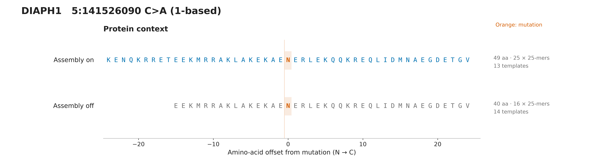
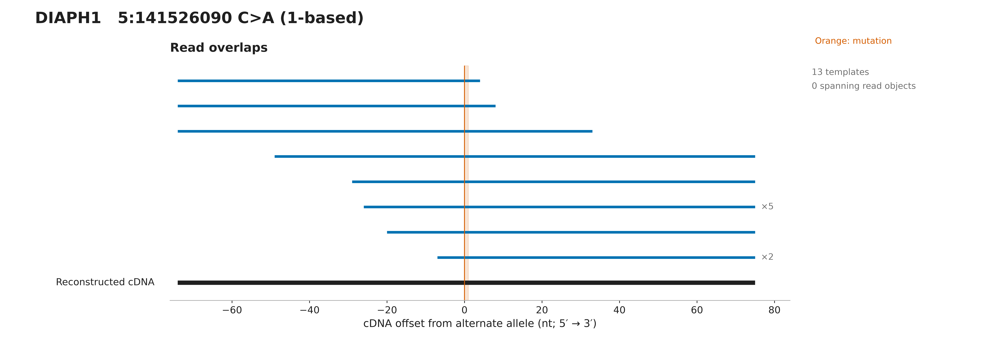
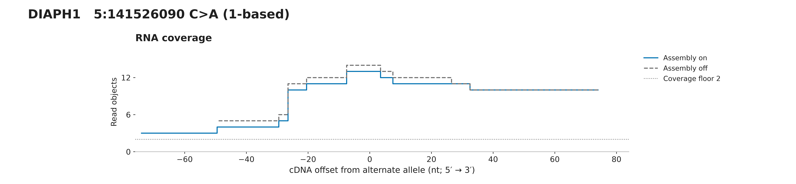
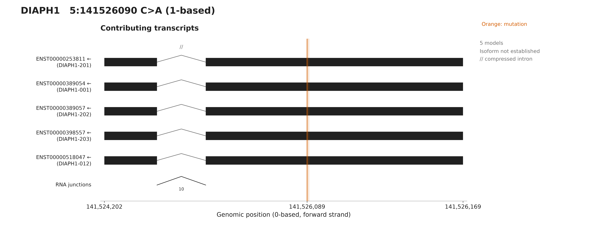

# DIAPH1 assembly comparison

Assembly recovers 49 aa rather than 40 aa, providing 25 rather than 16 mutation-overlapping 25-mers. Both sequences pass independent translation and transcript-reference checks; the shorter output is not mistranslated. No single read object spans the full reconstructed cDNA. These are selected primary-only original RNA fixtures, not full-sample abundance estimates.

## Protein context

[PNG](protein.png) · [SVG](protein.svg)

## Read overlaps

[PNG](reads.png) · [SVG](reads.svg)

## RNA coverage

[PNG](coverage.png) · [SVG](coverage.svg)

## Transcripts

[PNG](transcripts.png) · [SVG](transcripts.svg)

[All panels PDF](all-figures.pdf) · [Overview](overview.svg) · [Figure notes](caption.md) · [Evidence](evidence.json)

Source variant: https://osteosarc.com/variant/DIAPH1-chr5-141526090/

Source RNA product: `1b66c15da594a3ef`. Fixture: `09-DIAPH1-chr5-141526090-1b66c15da594a3ef.primary.bam`.

See evidence.json for exact settings, transcript models, checksums and independent validation.
