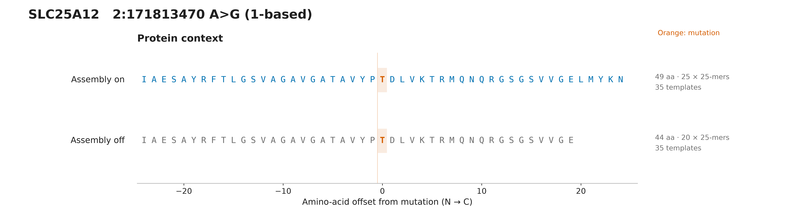
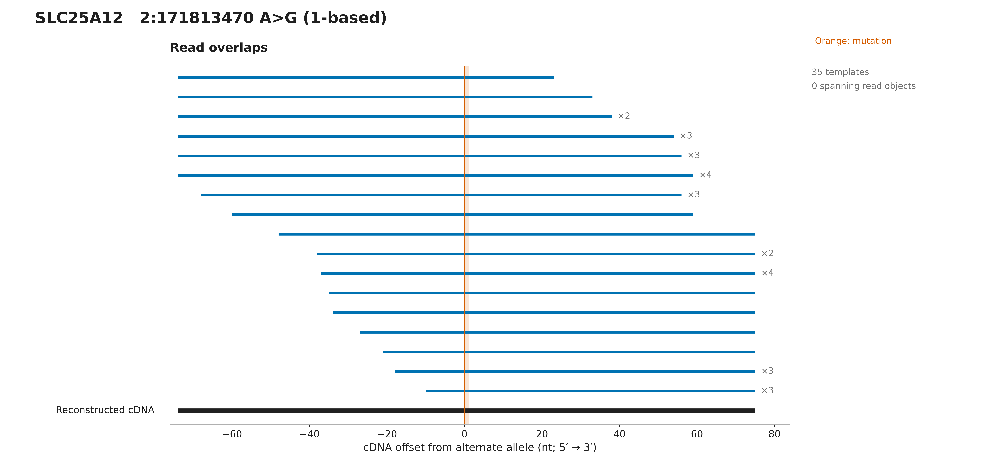
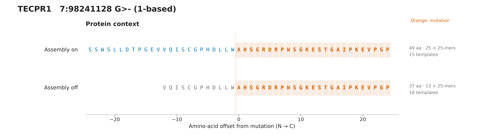
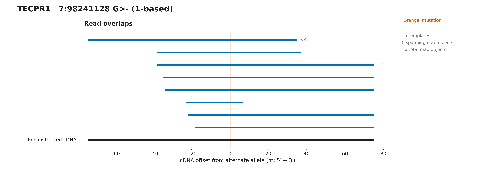

# Osteosarc assembly figures

Reproduce: `python -m examples.osteosarc_assembly_figures --output-dir figures/osteosarc`

White-background SVG (editable vector text) and 600-dpi PNG. Each variant has separate protein, read-overlap, coverage and transcript figures, plus a 300-dpi overview preview, a multipage all-figures.pdf, captions and evidence.json. Source reads are public CC0 osteosarc.com data; see tests/data/osteosarc/README.md for source and selection details.

Assembly recovers missing local context in these examples. This does not establish a unique isoform, full-length protein, peptide presentation, or clinical suitability. The comparison changes only overlap assembly; mate merging stays enabled in both modes.

## 09-DIAPH1-chr5-141526090-1b66c15da594a3ef

Assembly recovers 49 aa rather than 40 aa, providing 25 rather than 16 mutation-overlapping 25-mers. Both sequences pass independent translation and transcript-reference checks; the shorter output is not mistranslated. No single read object spans the full reconstructed cDNA. These are selected primary-only original RNA fixtures, not full-sample abundance estimates.

[All panels and captions](DIAPH1-5-141526090-C-A/README.md) · [Evidence](DIAPH1-5-141526090-C-A/evidence.json)

## 34-SLC25A12-chr2-171813470-fbea0bf403520431

Assembly recovers 49 aa rather than 44 aa, providing 25 rather than 20 mutation-overlapping 25-mers. Both sequences pass independent translation and transcript-reference checks; the shorter output is not mistranslated. No single read object spans the full reconstructed cDNA. These are selected primary-only original RNA fixtures, not full-sample abundance estimates.

[All panels and captions](SLC25A12-2-171813470-A-G/README.md) · [Evidence](SLC25A12-2-171813470-A-G/evidence.json)

## 36-TECPR1-chr7-98241127-8fda918141cedf55

Assembly recovers 49 aa rather than 37 aa, providing 25 rather than 13 mutation-overlapping 25-mers. Both sequences pass independent translation and transcript-reference checks; the shorter output is not mistranslated. No single read object spans the full reconstructed cDNA. These are selected primary-only original RNA fixtures, not full-sample abundance estimates.

[All panels and captions](TECPR1-7-98241128-G-del/README.md) · [Evidence](TECPR1-7-98241128-G-del/evidence.json)
