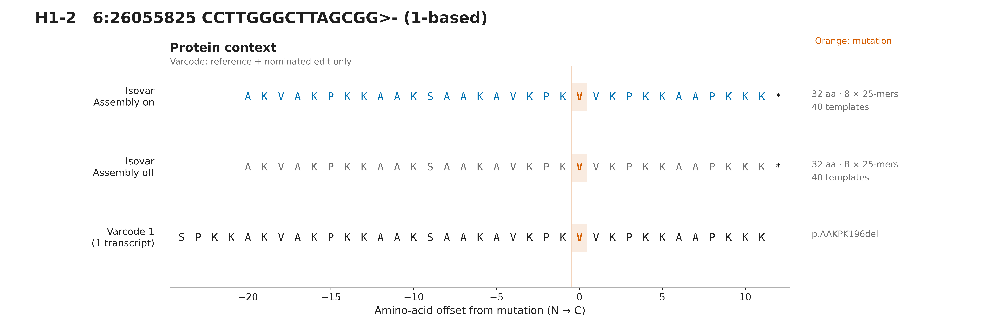
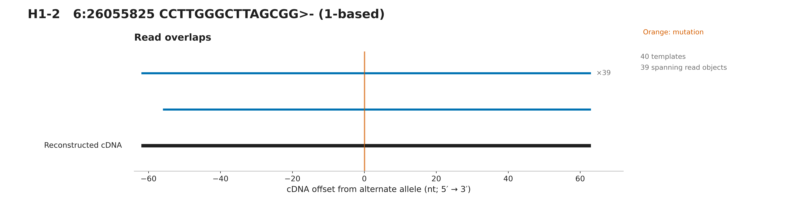
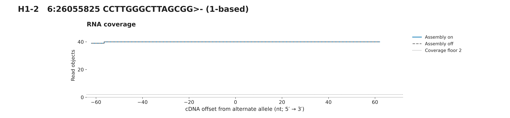
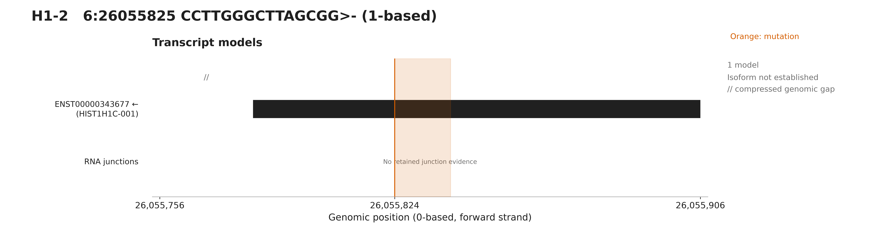

# H1-2 assembly comparison

Assembly on: 32 aa and 8 mutation-overlapping 25-mers; assembly off: 32 aa and 8 25-mers. Both outputs pass independent RNA translation, frame and interval checks. H1-2 is named HIST1H1C in the pinned Ensembl 87 annotation. This is a 15-nt in-frame deletion, not a structural variant. Varcode's repeat-normalized deletion label differs from the source label; the full mutant sequence is independently checked. Selected primary-only original RNA fixtures are not full-sample abundance estimates. Varcode tracks assume only the nominated edit on each reference transcript.

## Protein context

[PNG](protein.png) · [SVG](protein.svg)

## Read overlaps

[PNG](reads.png) · [SVG](reads.svg)

## RNA coverage

[PNG](coverage.png) · [SVG](coverage.svg)

## Transcripts

[PNG](transcripts.png) · [SVG](transcripts.svg)

[All panels PDF](all-figures.pdf) · [Overview](overview.svg) · [Figure notes](caption.md) · [Evidence](evidence.json)

Source variant: https://osteosarc.com/variant/H1_2-chr6-26055824/

Source RNA product: `1120a096937e29e1`. Fixture: `17-H1_2-chr6-26055824-1120a096937e29e1.primary.bam`.

See evidence.json for exact settings, transcript models, checksums and independent validation.
