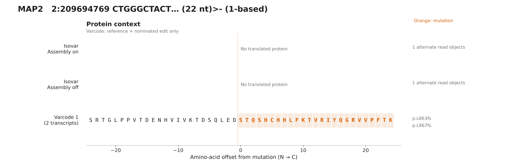
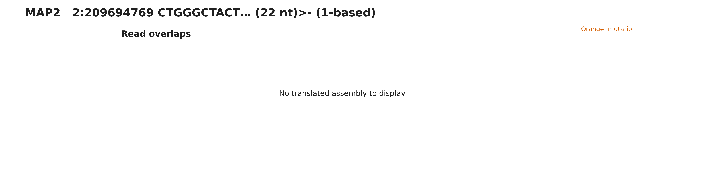
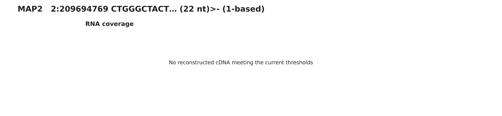
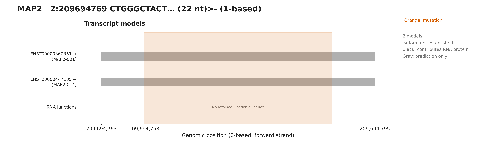

# MAP2 assembly comparison

No RNA-derived protein under the default coverage floor of two read objects. 1 alternate-supporting object(s) are available. Varcode supplies a prediction, not evidence of mutant expression.Selected primary-only original RNA fixtures are not full-sample abundance estimates. Varcode tracks assume only the nominated edit on each reference transcript.

## Protein context

[PNG](protein.png) · [SVG](protein.svg)

## Read overlaps

[PNG](reads.png) · [SVG](reads.svg)

## RNA coverage

[PNG](coverage.png) · [SVG](coverage.svg)

## Transcripts

[PNG](transcripts.png) · [SVG](transcripts.svg)

[All panels PDF](all-figures.pdf) · [Overview](overview.svg) · [Figure notes](caption.md) · [Evidence](evidence.json)

Source variant: https://osteosarc.com/variant/MAP2-chr2-209694768/

Source RNA product: `2bc1fc291308debb`. Fixture: `21-MAP2-chr2-209694768-2bc1fc291308debb.primary.bam`.

See evidence.json for exact settings, transcript models, checksums and independent validation.
