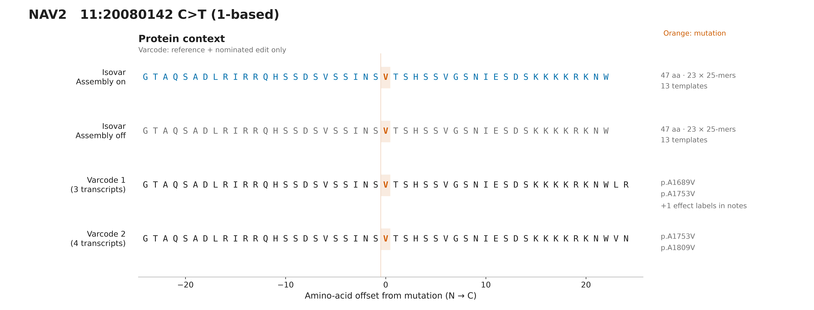
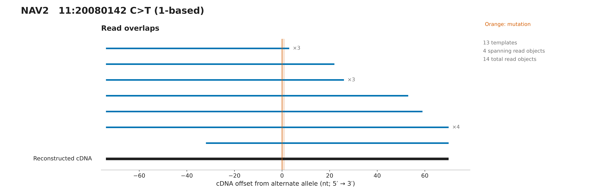
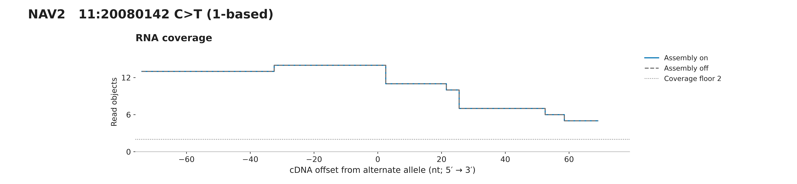
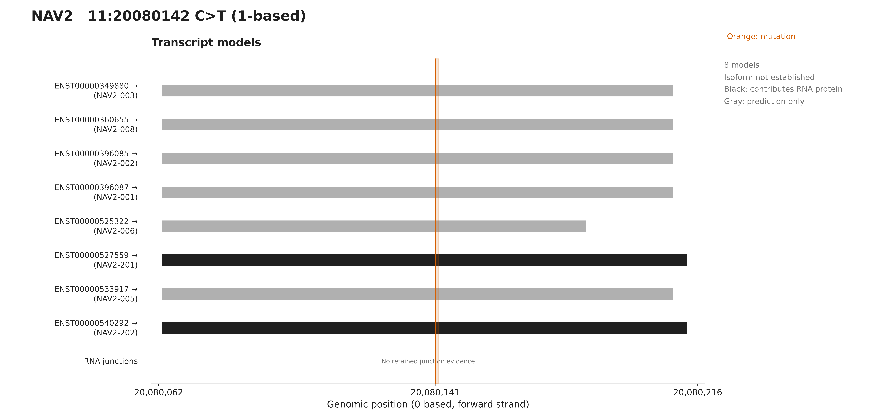

# NAV2 assembly comparison

Assembly on: 47 aa and 23 mutation-overlapping 25-mers; assembly off: 47 aa and 23 25-mers. Both outputs pass independent RNA translation, frame and interval checks. The current splice-aware output retains 2 contributing transcript models, not a unique isoform. Other Varcode predictions remain visible for comparison, not as isoform assignments. The earlier seven-isoform V/L comparison predates splice-path restriction and is not the current result. Black transcript models contribute to this RNA protein; gray models do not. The 47-aa RNA sequence ends at W, before the reference predictions diverge into LR or VN; those extra residues are predicted, not reconstructed. No junction remains inside this retained cDNA window. Path compatibility may use alignment beyond the plotted window. Selected primary-only original RNA fixtures are not full-sample abundance estimates. Varcode tracks assume only the nominated edit on each reference transcript.

## Protein context

[PNG](protein.png) · [SVG](protein.svg)

## Read overlaps

[PNG](reads.png) · [SVG](reads.svg)

## RNA coverage

[PNG](coverage.png) · [SVG](coverage.svg)

## Transcripts

[PNG](transcripts.png) · [SVG](transcripts.svg)

[All panels PDF](all-figures.pdf) · [Overview](overview.svg) · [Figure notes](caption.md) · [Evidence](evidence.json)

Source variant: https://osteosarc.com/variant/NAV2-chr11-20080142/

Source RNA product: `8fda918141cedf55`. Fixture: `25-NAV2-chr11-20080142-8fda918141cedf55.primary.bam`.

See evidence.json for exact settings, transcript models, checksums and independent validation.
