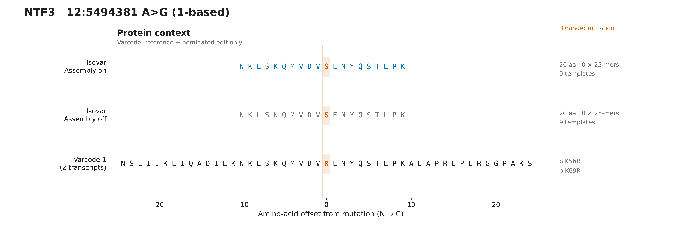
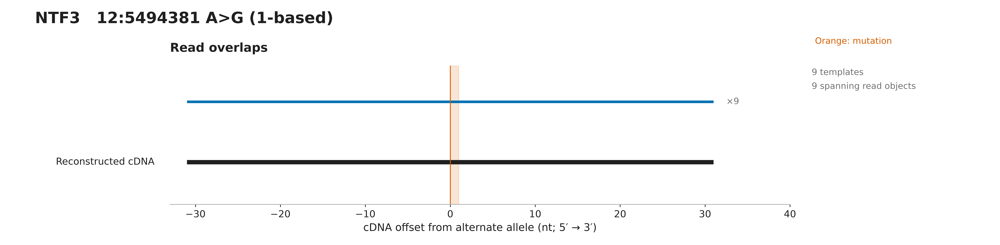
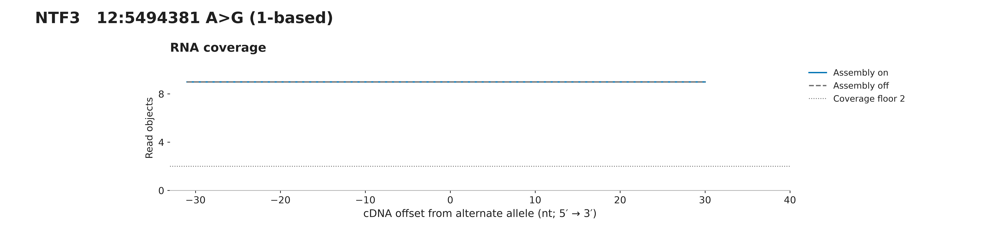
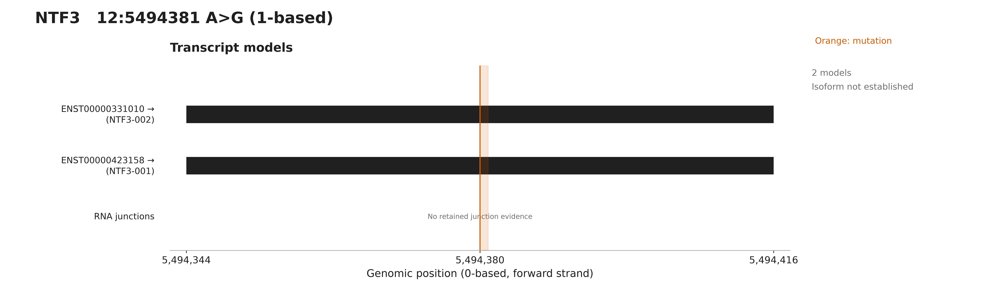

# NTF3 assembly comparison

Assembly on: 20 aa and 0 mutation-overlapping 25-mers; assembly off: 20 aa and 0 25-mers. Both outputs pass independent RNA translation, frame and interval checks. For the nominated chr12:5494381 A>G call, Varcode predicts K56R (K69R on the other model). RNA instead encodes serine: the adjacent change gives the source-linked compound AG>GT allele. This is a translated RNA-versus-single-edit difference, not proof of a germline or somatic origin for the second base. Both assembly modes recover it; assembly is not required here. Selected primary-only original RNA fixtures are not full-sample abundance estimates. Varcode tracks assume only the nominated edit on each reference transcript.

## Protein context

[PNG](protein.png) · [SVG](protein.svg)

## Read overlaps

[PNG](reads.png) · [SVG](reads.svg)

## RNA coverage

[PNG](coverage.png) · [SVG](coverage.svg)

## Transcripts

[PNG](transcripts.png) · [SVG](transcripts.svg)

[All panels PDF](all-figures.pdf) · [Overview](overview.svg) · [Figure notes](caption.md) · [Evidence](evidence.json)

Source variant: https://osteosarc.com/variant/NTF3-chr12-5494381/

Source RNA product: `53f498a544883d51`. Fixture: `28-NTF3-chr12-5494381-53f498a544883d51.primary.bam`.

See evidence.json for exact settings, transcript models, checksums and independent validation.
