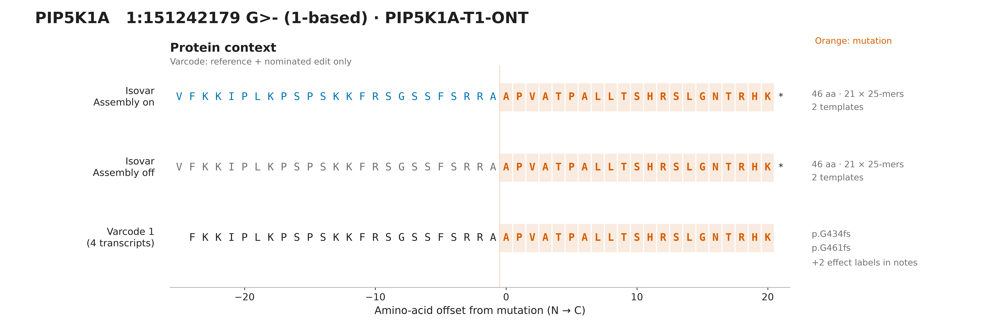
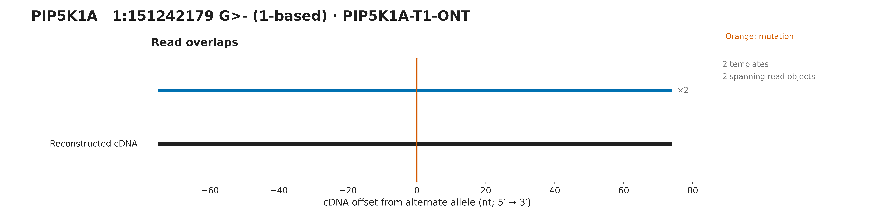
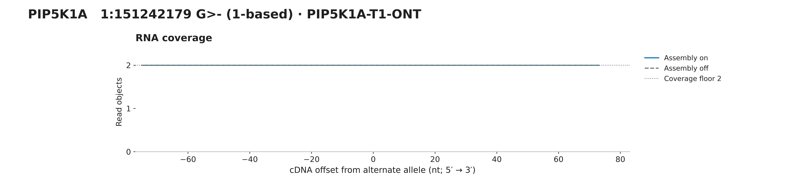
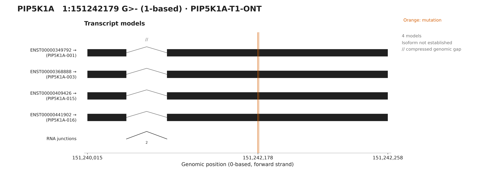

# PIP5K1A assembly comparison

Assembly on: 46 aa and 21 mutation-overlapping 25-mers; assembly off: 46 aa and 21 25-mers. Both outputs pass independent RNA translation, frame and interval checks. This is the complete acquired locus, not a selected read subset: PIP5K1A-T1-ONT. ONT and Illumina products are both catalogued T1, but are different processed libraries. The ONT sequence passes independent reference-plus-edit validation; the Illumina product has only one alternate read object. This demonstrates insufficient support in that product, not that short reads intrinsically cannot reconstruct the sequence or that read length alone explains the difference. ONT also reconstructs it without overlap assembly. No cell/molecule-level independence or matched malignant-cell composition is established.

## Protein context

[PNG](protein.png) · [SVG](protein.svg)

## Read overlaps

[PNG](reads.png) · [SVG](reads.svg)

## RNA coverage

[PNG](coverage.png) · [SVG](coverage.svg)

## Transcripts

[PNG](transcripts.png) · [SVG](transcripts.svg)

[All panels PDF](all-figures.pdf) · [Overview](overview.svg) · [Figure notes](caption.md) · [Evidence](evidence.json)

Source variant: https://osteosarc.com/variant/PIP5K1A-chr1-151242178/

Source RNA product: `53f498a544883d51`. Fixture: `PIP5K1A-T1-ONT.primary.bam`.

See evidence.json for exact settings, transcript models, checksums and independent validation.
