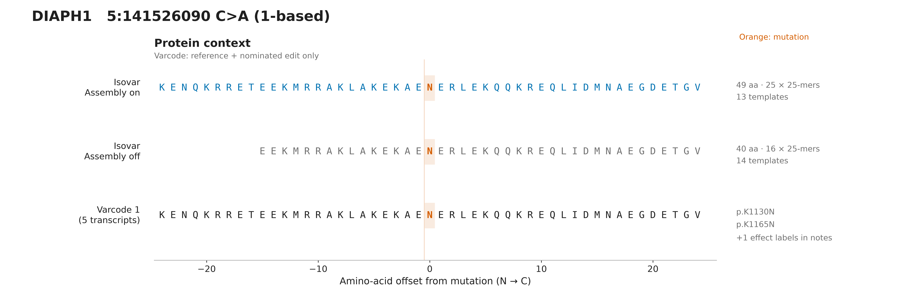
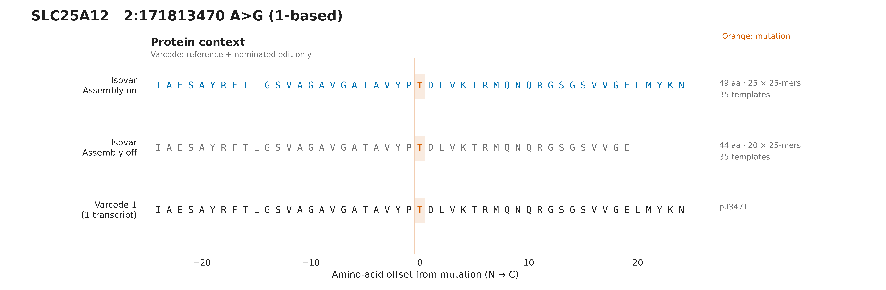
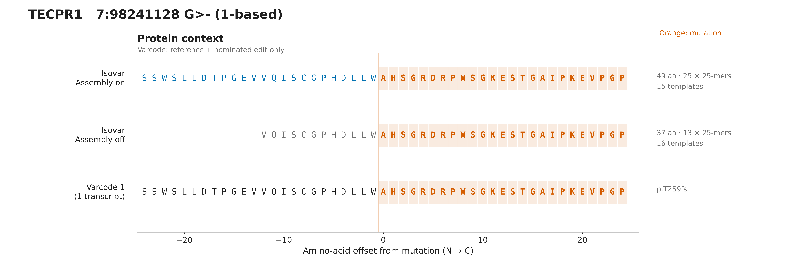
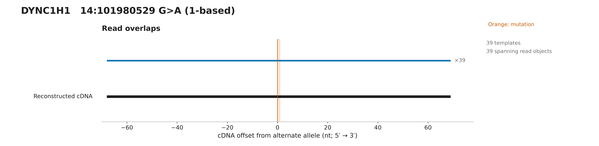
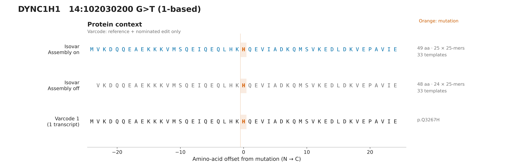
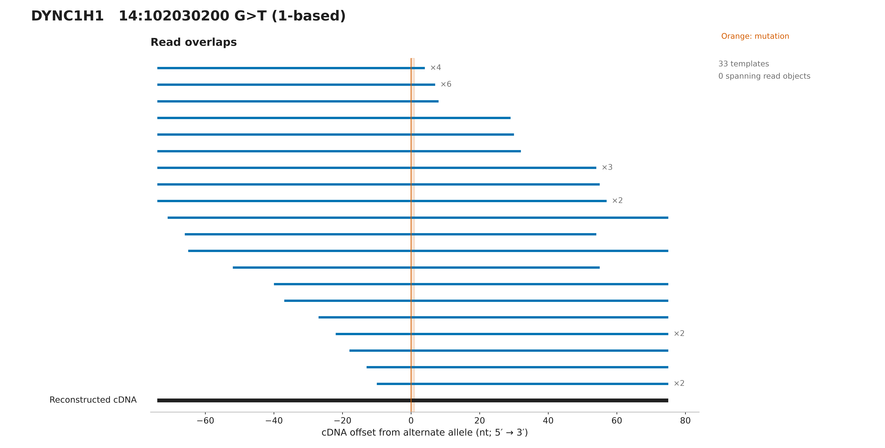
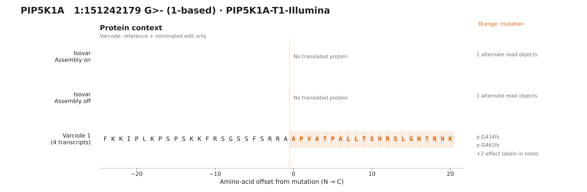
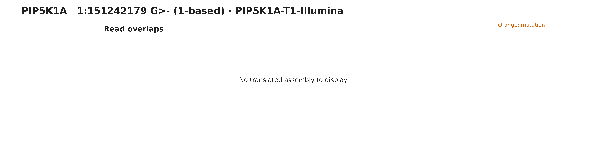

# Osteosarc assembly figures

[All eleven examples: 44-page vector PDF](all-figures.pdf) ·
[Original three examples: 12-page vector PDF](../2026-09-16_05-23-24-826750Z/three-examples-12-pages.pdf) ·
[Interpretation, DIAPH1 walkthrough, and SV limitations](../../../docs/visualization.md)

Reproduce: `python -m examples.osteosarc_assembly_figures --output-dir figures/osteosarc`

White-background SVG (editable vector text) and 600-dpi PNG. Each variant has separate protein, read-overlap, coverage and transcript figures, plus a 300-dpi overview preview, a multipage all-figures.pdf, captions and evidence.json. Source reads are public CC0 osteosarc.com data; see tests/data/osteosarc/README.md for source and selection details.

Assembly recovers missing context in the first three examples; later cases show agreement, insufficient support, transcript ambiguity and RNA differences from a single-edit prediction. This does not establish a unique isoform, full-length protein, peptide presentation, or clinical suitability. The comparison changes only overlap assembly; mate merging stays enabled in both modes.

## 09-DIAPH1-chr5-141526090-1b66c15da594a3ef

Assembly on: 49 aa and 25 mutation-overlapping 25-mers; assembly off: 40 aa and 16 25-mers. Both outputs pass independent RNA translation, frame and interval checks. Both also match the independent reference-plus-edit expectation. The shorter sequence is not mistranslated. No single read object spans the full reconstructed cDNA. Selected primary-only original RNA fixtures are not full-sample abundance estimates. Varcode tracks assume only the nominated edit on each reference transcript.

[All panels and captions](DIAPH1-5-141526090-C-A/README.md) · [Evidence](DIAPH1-5-141526090-C-A/evidence.json)

## 34-SLC25A12-chr2-171813470-fbea0bf403520431

Assembly on: 49 aa and 25 mutation-overlapping 25-mers; assembly off: 44 aa and 20 25-mers. Both outputs pass independent RNA translation, frame and interval checks. Both also match the independent reference-plus-edit expectation. The shorter sequence is not mistranslated. No single read object spans the full reconstructed cDNA. Selected primary-only original RNA fixtures are not full-sample abundance estimates. Varcode tracks assume only the nominated edit on each reference transcript.

[All panels and captions](SLC25A12-2-171813470-A-G/README.md) · [Evidence](SLC25A12-2-171813470-A-G/evidence.json)

## 36-TECPR1-chr7-98241127-8fda918141cedf55

Assembly on: 49 aa and 25 mutation-overlapping 25-mers; assembly off: 37 aa and 13 25-mers. Both outputs pass independent RNA translation, frame and interval checks. Both also match the independent reference-plus-edit expectation. The shorter sequence is not mistranslated. No single read object spans the full reconstructed cDNA. Selected primary-only original RNA fixtures are not full-sample abundance estimates. Varcode tracks assume only the nominated edit on each reference transcript.

[All panels and captions](TECPR1-7-98241128-G-del/README.md) · [Evidence](TECPR1-7-98241128-G-del/evidence.json)

## 10-DYNC1H1-chr14-101980529-53f498a544883d51

Assembly on: 45 aa and 21 mutation-overlapping 25-mers; assembly off: 45 aa and 21 25-mers. Both outputs pass independent RNA translation, frame and interval checks. Selected primary-only original RNA fixtures are not full-sample abundance estimates. Varcode tracks assume only the nominated edit on each reference transcript.

[All panels and captions](DYNC1H1-14-101980529-G-A/README.md) · [Evidence](DYNC1H1-14-101980529-G-A/evidence.json)

## 11-DYNC1H1-chr14-102030200-1b66c15da594a3ef

Assembly on: 49 aa and 25 mutation-overlapping 25-mers; assembly off: 48 aa and 24 25-mers. Both outputs pass independent RNA translation, frame and interval checks. Selected primary-only original RNA fixtures are not full-sample abundance estimates. Varcode tracks assume only the nominated edit on each reference transcript.

[All panels and captions](DYNC1H1-14-102030200-G-T/README.md) · [Evidence](DYNC1H1-14-102030200-G-T/evidence.json)

## 17-H1_2-chr6-26055824-1120a096937e29e1

Assembly on: 32 aa and 8 mutation-overlapping 25-mers; assembly off: 32 aa and 8 25-mers. Both outputs pass independent RNA translation, frame and interval checks. H1-2 is named HIST1H1C in the pinned Ensembl 87 annotation. This is a 15-nt in-frame deletion, not a structural variant. Varcode's repeat-normalized deletion label differs from the source label; the full mutant sequence is independently checked. Selected primary-only original RNA fixtures are not full-sample abundance estimates. Varcode tracks assume only the nominated edit on each reference transcript.

[All panels and captions](H1-2-6-26055825-CCTTGGGCTTAGCGG-del/README.md) · [Evidence](H1-2-6-26055825-CCTTGGGCTTAGCGG-del/evidence.json)

## 21-MAP2-chr2-209694768-2bc1fc291308debb

No RNA-derived protein under the default coverage floor of two read objects. 1 alternate-supporting object(s) are available. Varcode supplies a prediction, not evidence of mutant expression.Selected primary-only original RNA fixtures are not full-sample abundance estimates. Varcode tracks assume only the nominated edit on each reference transcript.

[All panels and captions](MAP2-2-209694769-CTGGGCTACTGTGTGTTCAATA-del/README.md) · [Evidence](MAP2-2-209694769-CTGGGCTACTGTGTGTTCAATA-del/evidence.json)

## 25-NAV2-chr11-20080142-8fda918141cedf55

Assembly on: 47 aa and 23 mutation-overlapping 25-mers; assembly off: 47 aa and 23 25-mers. Both outputs pass independent RNA translation, frame and interval checks. The current splice-aware output retains 2 contributing transcript models, not a unique isoform. Other Varcode predictions remain visible for comparison, not as isoform assignments. The earlier seven-isoform V/L comparison predates splice-path restriction and is not the current result. Black transcript models contribute to this RNA protein; gray models do not. The 47-aa RNA sequence ends at W, before the reference predictions diverge into LR or VN; those extra residues are predicted, not reconstructed. No junction remains inside this retained cDNA window. Path compatibility may use alignment beyond the plotted window. Selected primary-only original RNA fixtures are not full-sample abundance estimates. Varcode tracks assume only the nominated edit on each reference transcript.

[All panels and captions](NAV2-11-20080142-C-T/README.md) · [Evidence](NAV2-11-20080142-C-T/evidence.json)

## 28-NTF3-chr12-5494381-53f498a544883d51

Assembly on: 20 aa and 0 mutation-overlapping 25-mers; assembly off: 20 aa and 0 25-mers. Both outputs pass independent RNA translation, frame and interval checks. For the nominated chr12:5494381 A>G call, Varcode predicts K56R (K69R on the other model). RNA instead encodes serine: the adjacent change gives the source-linked compound AG>GT allele. This is a translated RNA-versus-single-edit difference, not proof of a germline or somatic origin for the second base. Both assembly modes recover it; assembly is not required here. Selected primary-only original RNA fixtures are not full-sample abundance estimates. Varcode tracks assume only the nominated edit on each reference transcript.

[All panels and captions](NTF3-12-5494381-A-G/README.md) · [Evidence](NTF3-12-5494381-A-G/evidence.json)

## PIP5K1A-T1-ONT

Assembly on: 46 aa and 21 mutation-overlapping 25-mers; assembly off: 46 aa and 21 25-mers. Both outputs pass independent RNA translation, frame and interval checks. This is the complete acquired locus, not a selected read subset: PIP5K1A-T1-ONT. ONT and Illumina products are both catalogued T1, but are different processed libraries. The ONT sequence passes independent reference-plus-edit validation; the Illumina product has only one alternate read object. This demonstrates insufficient support in that product, not that short reads intrinsically cannot reconstruct the sequence or that read length alone explains the difference. ONT also reconstructs it without overlap assembly. No cell/molecule-level independence or matched malignant-cell composition is established.

[All panels and captions](PIP5K1A-T1-ONT/PIP5K1A-1-151242179-G-del/README.md) · [Evidence](PIP5K1A-T1-ONT/PIP5K1A-1-151242179-G-del/evidence.json)

## PIP5K1A-T1-Illumina

No RNA-derived protein under the default coverage floor of two read objects. 1 alternate-supporting object(s) are available. Varcode supplies a prediction, not evidence of mutant expression.This is the complete acquired locus, not a selected read subset: PIP5K1A-T1-Illumina. ONT and Illumina products are both catalogued T1, but are different processed libraries. The ONT sequence passes independent reference-plus-edit validation; the Illumina product has only one alternate read object. This demonstrates insufficient support in that product, not that short reads intrinsically cannot reconstruct the sequence or that read length alone explains the difference. ONT also reconstructs it without overlap assembly. No cell/molecule-level independence or matched malignant-cell composition is established.

[All panels and captions](PIP5K1A-T1-Illumina/PIP5K1A-1-151242179-G-del/README.md) · [Evidence](PIP5K1A-T1-Illumina/PIP5K1A-1-151242179-G-del/evidence.json)
